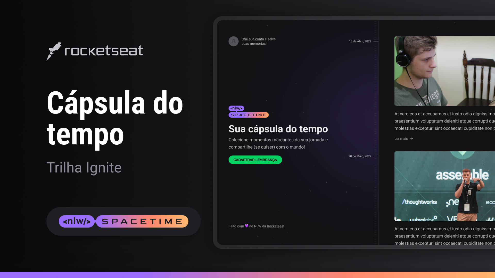

# Spacetime




## Sobre

O projeto Spacetime é uma aplicação de recordação de memórias, onde o usuário poderá adicionar à uma timeline textos, fotos e vídeos de acontecimentos marcantes da sua vida, organizados por mês e ano, o projeto tem tanto a versão mobile quando o back end e front end web. Esse e uma aplicação que desenvolvida no NLW da rocketseat.

## Instalação

```bash title="Clone o repositório"
git clone https://github.com/manoguii/spacetime.git
```

- Para rodar o projeto localmente
  - Server
    1. Primeiro você precisa acessar a pasta do ```server```
    2. Crie um arquivo ```.env.local``` na raiz do projeto e preencha as variáveis ambiente, o exemplo de como deve ficar esta em ```.env.example```
    3. Instale as dependências ```pnpm install```
    4. Rodar as migrations ```pnpm exec prisma migrate dev```
    5. Execute a aplicação. ```pnpm dev```
    6. Acesse `http://localhost:3333`
  - Web
    1. Primeiro você precisa acessar a pasta do ```web```
    2. Crie um arquivo ```.env.local``` na raiz do projeto e preencha as variáveis ambiente, o exemplo de como deve ficar esta em ```.env.example```
    3. Instale as dependências ```pnpm install```
    4. Execute a aplicação. ```pnpm dev```
    5. Acesse `http://localhost:3000`
  - Mobile
    1. Primeiro você precisa acessar a pasta do ```mobile```
    2. Crie um arquivo ```.env.local``` na raiz do projeto e preencha as variáveis ambiente, o exemplo de como deve ficar esta em ```.env.example```
    3. Instale as dependências ```npm install```
    4. Execute a aplicação. ```npx exec expo start```
    5. Caso queira visualizar o app no seu dispositivo baixo o app ```expo``` e leia o QR code que aparece no terminal.

## Tecnologias

- [ReactJS](https://reactjs.org/)
- [NextJS](https://nextjs.org/)
- [TypeScript](https://www.typescriptlang.org/)
- [React Hook Form](https://www.react-hook-form.com/)
- [Zod](https://zod.dev/)
- [Prisma](https://www.prisma.io/)
- Fastify
- Expo
- JWT
- Tailwind

---  

<center>Made with 💙 by Guilherme David</center>
